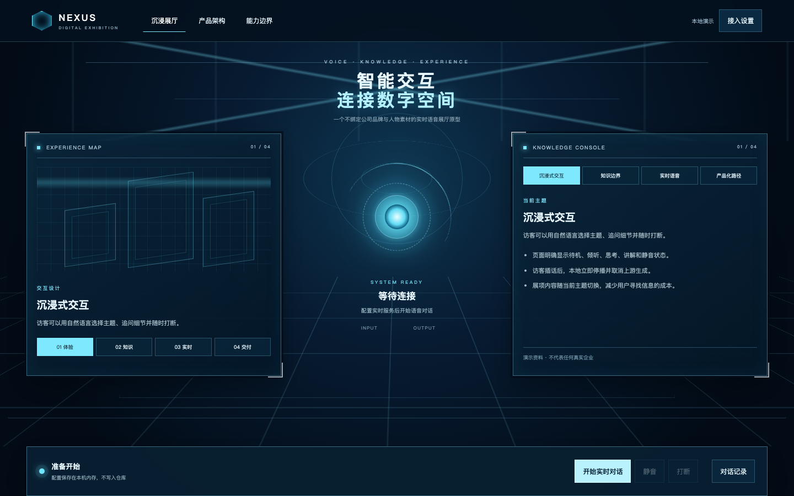

# Digital Exhibition Voice Agent

一个不绑定公司品牌与人物形象的实时语音数字展厅原型。页面使用抽象语音光核表达待机、倾听、思考与讲解状态，不包含公司名称、Logo、真实项目资料、人物照片或三维人物资产。



## 可演示能力

- 科技展厅界面与四类通用产品主题。
- 浏览器麦克风输入、实时语音回答和流式播放。
- 输入与输出音量可视化。
- 用户打断：客户端立即停播，同时取消上游生成。
- 本地接入设置；API Key 只保存在当前 Node.js 进程内存。
- 对话转写记录，以及产品架构和能力边界说明。

## 本地运行

需要 Node.js 22 或更高版本。

```bash
npm install
npm run dev
```

打开 <http://127.0.0.1:5173>。首次使用时进入“接入设置”，填写阿里云百炼北京地域的 API Key 和完整 API Host，例如：

```text
ws-example.cn-beijing.maas.aliyuncs.com
```

也可以复制 `.env.example` 为 `.env`，再填写本地环境变量。`.env` 已被 Git 忽略，不应提交密钥。

## 验证

```bash
npm test
npm run build
npm start
```

`npm start` 提供生产构建，仅监听本机 `127.0.0.1`。

## 能力边界

- 当前中央视觉为 CSS 抽象光核，不是人物、照片或三维数字人。
- 当前资料是通用产品说明，不代表任何真实企业或项目。
- 当前采用少量资料直接随会话提供，不是向量数据库或 RAG。
- 浏览器请求回声消除、降噪和自动增益，但真实展厅仍需声学与设备验收。
- 仓库没有托管配置；公开部署需要 HTTPS、身份验证、限流、预算控制、审计与凭证管理。
- 所有云端能力、费用和可用性以所使用服务的当前官方说明与账户权限为准。

## 目录

```text
data/knowledge.json      通用演示知识
public/pcm-worklet.js    麦克风 PCM 采集与 16 kHz 重采样
src/audio.js             输入采集与 24 kHz 流式播放
src/main.js              页面状态、实时协议与打断
src/style.css            展厅与抽象光核视觉
server.mjs               本地配置和实时 WebSocket 代理
server-validation.mjs    Key 与北京 API Host 输入验证
```

## 隐私

不要把 API Key 发到聊天、Issue、截图或提交中。网页配置接口仅允许本机来源访问，不回传 Key；配置在进程退出后清除。

## License

MIT
